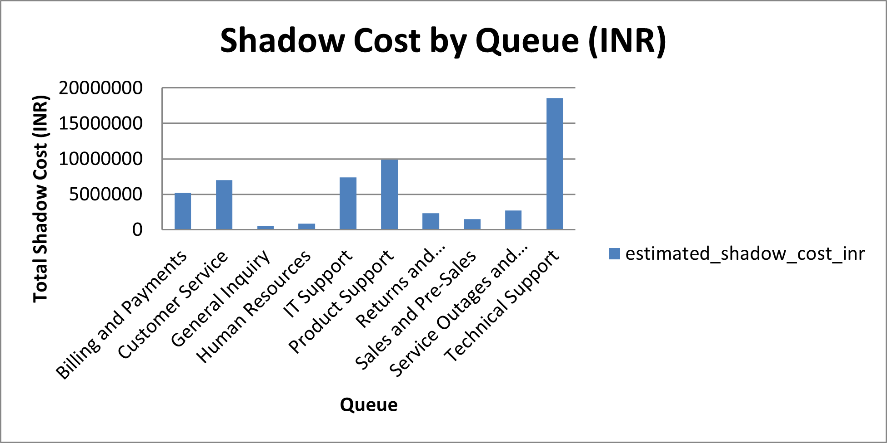
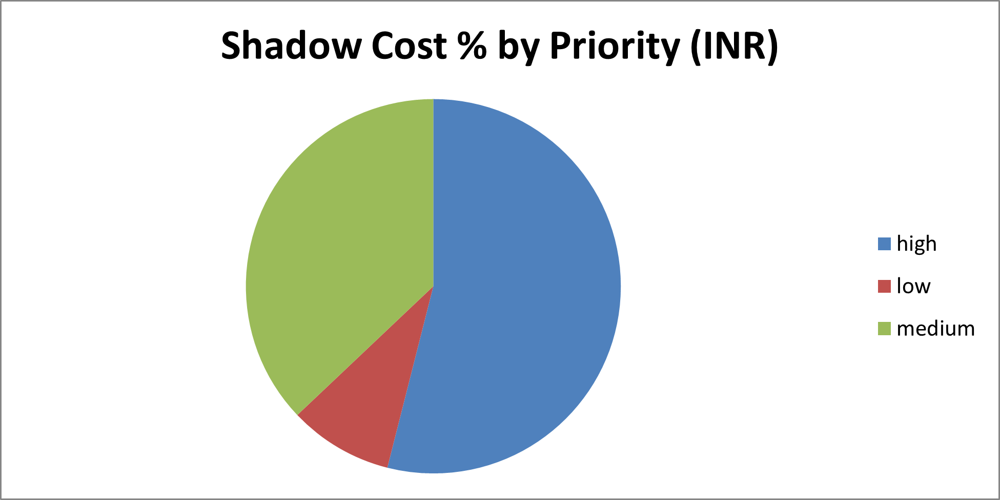

# Shadow-Cost-Analysis-of-delay-in-IT-Support
Quantifying hidden business losses from delayed IT support ticket resolution using Excel, SQL, and Python.

This project estimates the hidden business impact caused by delays in resolving IT support tickets. It uses real support ticket data and calculates "shadow cost" based on time-to-resolution (TTR) and priority levels. This is part of a unique beginner-friendly data analytics portfolio that goes beyond typical dashboard projects.

## Dataset Source:

Kaggle: [Multilingual Customer Support Tickets](https://www.kaggle.com/datasets/tobiasbueck/multilingual-customer-support-tickets)  
- Author: Tobias Bueck  
- 2.2M+ realistic synthetic tickets across 14 languages  
- Fields used: `ticket_id`, `priority`, `queue`, `duration_hours`, `estimated_shadow_cost_inr`, etc.

## Objective

To estimate the hidden financial impact ("shadow cost") caused by delayed resolution of IT support tickets. This project aims to quantify business losses associated with high-priority tickets by analyzing resolution durations using Excel, SQL, and Python — enabling data-driven decisions to improve IT support efficiency.

## Key Concepts Demonstrated:
- Data cleaning and transformation in Excel
- SQL queries for slicing ticket duration and cost summaries
- Python visualizations with seaborn and matplotlib
- Business impact quantification based on downtime

## Key Outputs:
- Total shadow cost by ticket priority
- Average resolution time by queue/team
- Top 10 highest-cost delayed tickets

## Tools & Skills:
- **Excel**: Shadow cost modeling
- **SQL**: Business queries (duration, cost by queue/priority)
- **Python**: EDA, visualization with pandas and seaborn

## Key Visuals:

The following visualizations were generated from the filtered English dataset:

1. Bar Chart – Total Estimated Shadow Cost by Queue
   
- This chart displays the total INR impact of ticket resolution delays across different support queues. It helps identify which teams are contributing the most to hidden business costs.

   
  
2. Pie Chart – Proportion of Shadow Costs by Priority

- This pie chart reveals how much each ticket priority (Low, Medium, High) contributes to the total shadow cost. It helps stakeholders understand which issue types drive the most cost when delayed.

   

## Files Included:
| File Name | Description |
|-----------|-------------|
| `Ticket_dump_cleaned.xlsx` | Cleaned data with calculated columns and removed few blanks in-between |
| `shadow_cost_analysis.sql` | SQL queries for business metrics |
| `shadow_cost_analysis.ipynb` | Jupyter notebook with visual insights |

## Key Insights:

- Technical Support is the top contributor to shadow cost, with losses estimated at ₹1.86 crore INR.
- High-priority tickets account for the largest share of business impact, with delays leading to a cumulative estimated loss of ₹3.02 crore.
- Product Support and IT Support queues together contribute over ₹1.7 crore in hidden costs.
- Even medium-priority tickets incur significant downtime cost—over ₹2 crore, underscoring the need for better mid-level prioritization.
- Delays in Billing and Payments also cost the company over ₹52 lakhs, indicating potential cash flow implications.

## Outcome:

This project successfully quantifies the hidden business impact of support ticket delays using realistic Time-to-Resolution (TTR) estimates and adjusted cost multipliers by priority level. Insights from this analysis can guide process optimization, resource allocation, and service level improvements across support queues. It also showcases proficiency in combining Excel dashboards, SQL logic, and Python analytics for decision-impactful analysis.
